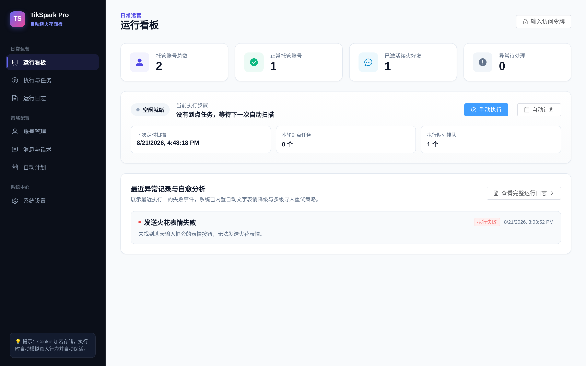
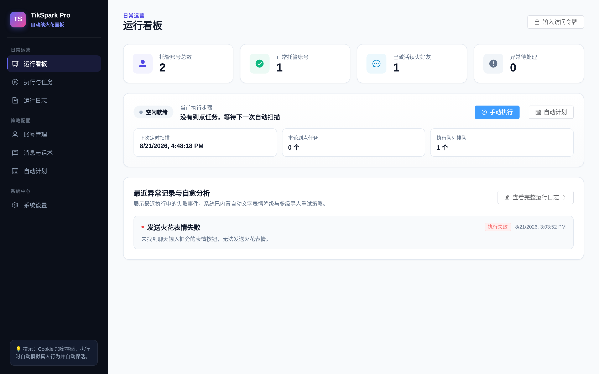
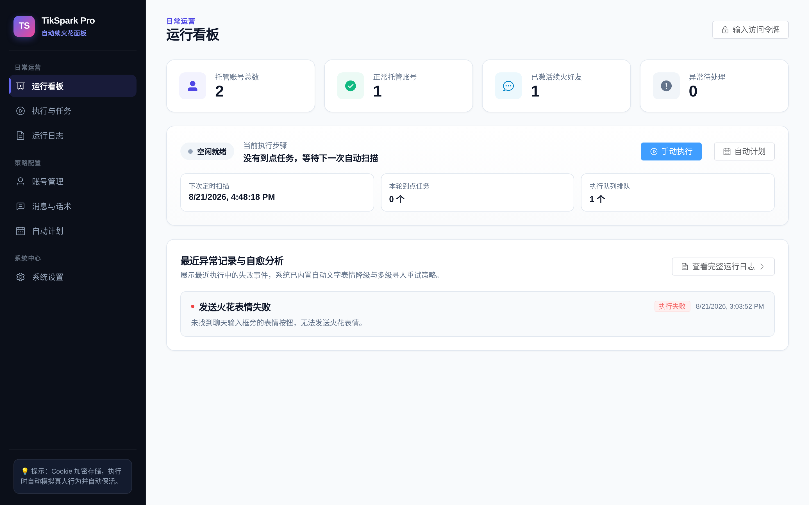
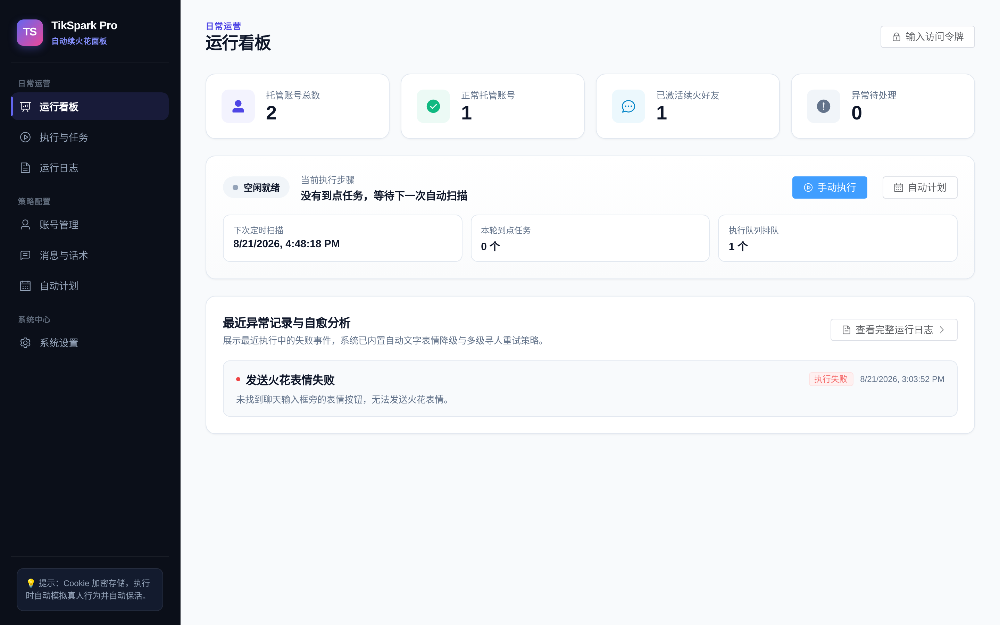
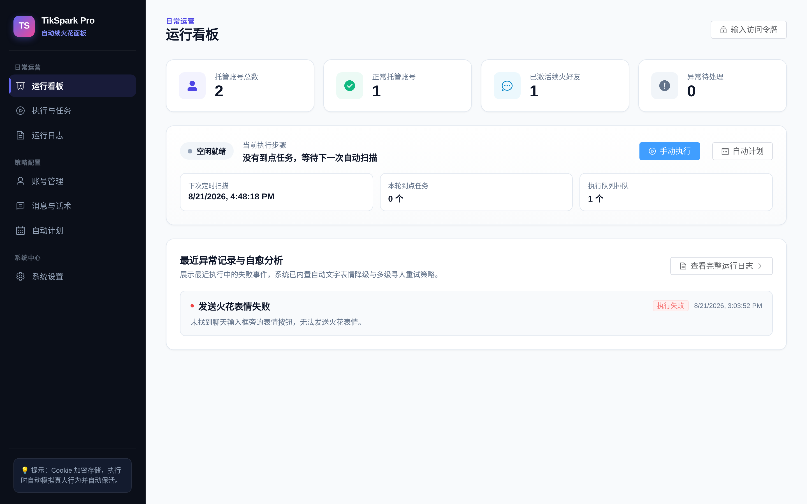

<div align="center">

# 🔥 TikSpark Pro

**抖音多账号火花自动维护与凭证托管面板**

全自动化 · 多账号托管 · 防风控错峰 · 智能保活 · 五级容错续火花 · 国内低配 VPS 专项优化

<p align="center">
  
  
  
  
  
  
</p>

</div>

---

## 📖 简介

**TikSpark Pro** 是一款专为维护抖音好友火花打造的轻量级全栈自动化管理面板。

采用 **FastAPI + Vue 3 (Element Plus) + Playwright** 架构，针对国内服务器网络和低配机型进行了深度调优。支持多账号凭证托管、私信好友智能检索、专属续火花表情自动发送、会话 Cookie 自动保活与错峰调度。

---

## ✨ 核心特性

- 🤖 **Playwright 深度拟人自动化**
  - 内置 `Stealth Evasion` 指纹伪装技术，抹除 `navigator.webdriver` 特征，模拟真实 Chrome 浏览器环境。
  - 防风控随机错峰与行为拟态，降低被抖音 WAF 识别的概率。

- 🔄 **Cookie 自动回写与无感保活**
  - 在每次执行自动化任务时，自动从浏览器上下文中提取抖音下发的最新 Token 并加密持久化至数据库，告别频繁掉线。

- 🎯 **五级智能好友定位与容错保底**
  - **名称归一化匹配**：自动过滤好友昵称中的 Emoji（🔥）、前后备注括号、特殊标点与多余空格。
  - **定向滚动加载**：定向触发左侧联系人容器滚轮事件，解决好友未预先渲染加载的问题。
  - **搜索框自愈**：未搜到目标时自动清空搜索词，绝不残留导致好友列表为空。
  - **文字表情兜底**：当抖音表情面板微调或无火花专属按钮时，**自动降级发送 `🔥` 文字表情保底**，确保火花不中断。
  - **一键重试自愈**：看板与任务列表内置【一键重试全部失败任务】，无需人工手动排查。

- ⚡ **国内低配 VPS 专项优化（Zero-Build）**
  - 仓库内已内置预编译好的 `frontend/dist/` 静态产物，**低配 VPS 完全免除 Node.js/npm 编译**，避免 1C1G/1C2G 机器爆内存卡死。
  - 自动切换 **清华 PyPI 镜像源** 与 **淘宝 npmmirror Playwright 内核下载源**，提速 70% 避免海外超时。
  - SQLite 开启 **WAL 预写日志模式**，大幅降低低配机器弱磁盘 IO 竞争。

- 🎨 **现代 Linear 极简 SaaS 交互设计**
  - 黑曜石质感深色侧边栏、实时引擎呼吸灯状态条、未来 7 天日历预览、异常自愈横幅。

---

## 🖼️ 界面展示

### 1. 运行看板（实时监控与一键自愈）
> 4 大核心指标卡片、引擎实时步骤呼吸灯、下次扫描倒计时与异常自愈引导。


### 2. 自动计划与 7 天执行日历
> 自动计划调度控制中心、未来 7 天时间线预估日历、批量策略配置与 5 级状态流转时间线。


### 3. 账号资产与凭证管理
> 账号 Cookie 本地加密托管、到期状态实时色标、私信好友秒级搜索与一键全部激活。


### 4. 执行与任务队列
> 精准按账号/好友手动即时触发、任务队列状态统计与实时详情抽屉。


### 5. 消息配置与随机话术库
> 固定消息 / 随机话术库 / 表情包模式，支持 `[火花]` 占位符与批量覆盖应用。


---

## 🚀 极速部署指南

### 方案 A：国内低配 VPS 极速一键部署（推荐，内存 < 150M）

适合阿里云 / 腾讯云 1C1G、1C2G 等性能有限的 Linux VPS（Ubuntu / Debian / CentOS）：

```bash
# 1. 拉取仓库（已包含预构建前端静态资源）
git clone https://github.com/yudual/tikspark-pro.git
cd tikspark-pro

# 2. 一键安装系统依赖、内核与国内镜像加速
chmod +x deploy_vps_quick.sh
./deploy_vps_quick.sh

# 3. 后台守护启动（建议设置自定义安全令牌）
nohup env TIKSPARK_ADMIN_TOKEN=你的自定义安全密码 .venv/bin/python main.py > tikspark.log 2>&1 &
```

---

### 方案 B：Docker 容器化部署（1Panel / Docker Compose）

Dockerfile 已优化为**直接复制预编译前端**，无需在容器内下载 Node 镜像与安装 npm，构建仅需几秒：

```bash
# 1. 克隆代码
git clone https://github.com/yudual/tikspark-pro.git
cd tikspark-pro

# 2. 编辑 docker-compose.yml 设置 TIKSPARK_ADMIN_TOKEN 密码
# 3. 一键启动
docker compose up -d --build
```

---

### 方案 C：本地开发与调试

```bash
# 1. 创建虚拟环境并安装依赖
python3 -m venv .venv
.venv/bin/pip install -i https://pypi.tuna.tsinghua.edu.cn/simple -r backend/requirements.txt
.venv/bin/python -m playwright install chromium

# 2. 运行后端 (端口 8010)
.venv/bin/python main.py

# 3. 启动前端热重载开发 (可选)
cd frontend
npm install
npm run dev
```

---

## ⚙️ 环境变量配置

可复制 `.env.example` 为 `.env` 或通过 Docker / 启动命令传入：

| 变量名 | 说明 | 默认值 | 建议 |
| :--- | :--- | :--- | :--- |
| `TIKSPARK_ADMIN_TOKEN` | 管理员访问令牌（鉴权密钥） | 空 | **公网部署必填**，网页右上角填入相同值解锁 |
| `TIKSPARK_SCHEDULER_ENABLED` | 是否启动后台自动调度引擎 | `true` | 初次上线建议先填 `false`，确认无误后再开启 |
| `TIKSPARK_SCHEDULER_SCAN_INTERVAL_SECONDS` | 定时扫描轮询间隔（秒） | `60` | 推荐 60 秒 |
| `TIKSPARK_MANUAL_REVIEW_MODE` | 人工复核安全模式（只记录不真实发信） | `false` | 调试排查时可设为 `true` |
| `TIKSPARK_SQLITE_PATH` | SQLite 数据库文件路径 | `backend/data/tikspark.db` | 持久化挂载该目录 |
| `TIKSPARK_SECRET_KEY_PATH` | Cookie 本地加密秘钥路径 | `backend/data/secret.key` | **需与数据库一同备份** |

---

## 📦 数据安全与备份（重要）

数据与 Cookie 凭证持久化存储在 `backend/data/` 目录中：
- `tikspark.db`：账号、好友关系与调度计划数据库。
- `secret.key`：Cookie 加密秘钥（由系统首次启动时自动随机生成）。

> ⚠️ **注意**：备份时**必须同时打包这两个文件**，若遗失 `secret.key` 将无法解密已保存的 Cookie。

```bash
# 一键备份命令
tar -czf tikspark-backup-$(date +%F).tar.gz backend/data/
```

---

## 🛠️ 项目结构

```text
tikspark-pro/
├── backend/                  # FastAPI 后端服务
│   ├── app/
│   │   ├── routers/          # API 路由 (dashboard, accounts, run, messages, schedule)
│   │   ├── services/         # 核心服务 (execution_service, dispatch, credential)
│   │   ├── database.py       # SQLite WAL 模式数据库连接
│   │   └── models.py         # SQLAlchemy 数据模型
│   └── tests/                # 自动化集成与单元测试
├── frontend/                 # Vue 3 + TypeScript 前端项目
│   ├── dist/                 # 预构建前端静态资源 (入库免编译)
│   ├── src/                  # 前端源码
│   └── vite.config.ts        # Vite 构建配置
├── docs/                     # 文档与高清界面截图
│   └── images/               # 各模块高清截图
├── deploy_vps_quick.sh       # 国内低配 VPS 极速一键部署脚本
├── Dockerfile                # 轻量化生产 Dockerfile
├── docker-compose.yml        # Docker Compose 编排文件
└── main.py                   # 单端口全栈启动入口
```

---

## ⚖️ 免责声明

1. 本项目仅供个人学习、技术研究与少量个人账号关系维护使用。
2. 请严格遵守抖音平台的相关使用协议与服务条款。
3. 请合理配置续火时段与错峰间隔，避免频繁请求，使用者需自行评估并承担账号相关风险。
